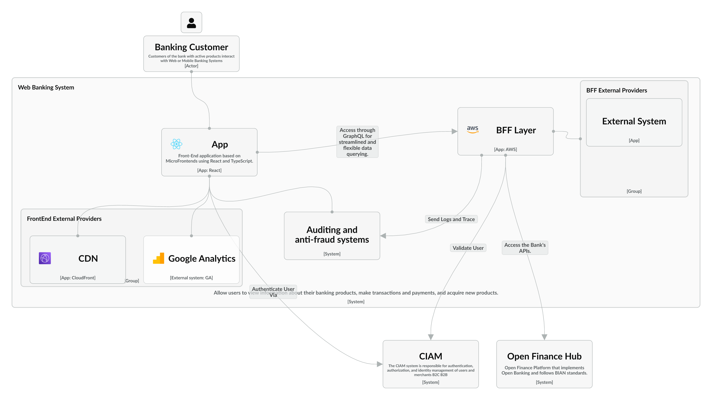

## Contenedor Web Banking System

### Application Structure: Single Page Application (SPA) in React Native

1. **Architecture:**
   - The application follows a **MicroFrontends architecture**, allowing modular development and scalability.

2. **Authentication:**
   - User authentication is handled through a **Universal Login** system to ensure consistency and security.

3. **Backend For Frontend (BFF):**
   - The application includes its own **BFF layer**, specifically designed to:
     - Connect to external providers for marketing analysis, behavioral data, and other integrations.
     - Support popular tools like **Google Analytics**, with flexibility to integrate with any other stack.

4. **Performance Optimization:**
   - The system uses a **Content Delivery Network (CDN)** to enhance performance, scalability, and reliability.

5. **Shared Systems:**
   - Both the application and the BFF layer use a unified system for:
     - **Auditing and Logging.**
     - **Anti-fraud detection.**
   - These systems operate on a per-channel basis and publish their events to a centralized system for monitoring and reporting.

6. **Banking and Financial Tasks:**
   - The BFF connects to the **Open Finance Hub** to execute the client's banking and financial operations.

7. **GraphQL Integration:**
   - The web application communicates with the BFF through **GraphQL**, improving performance, flexibility, and the overall user experience.

   