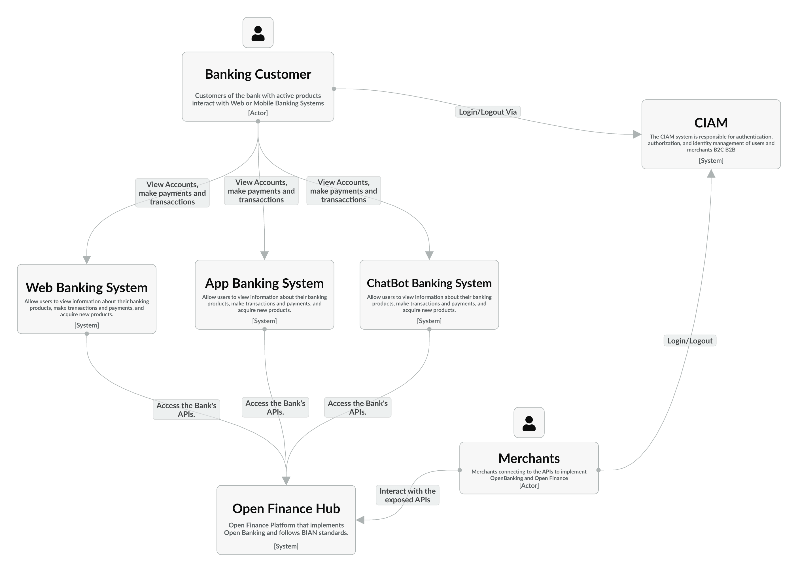

## Context
A Bank User connects to the web, app, and chatbot channels. These channels first require authentication through a login on the application or a Universal Login system.
Once authenticated, the user can perform transactions, make payments, acquire, and manage banking products, depending on the scope of the preferred channel.
The web, app, and chatbot systems interact with the APIs exposed by the Open Finance Hub to execute the transactions requested by the customer.

Merchants can access the Open Banking system and the exposed APIs once authenticated.

### Important Note:

For the APIs of the Open Finance Hub to meet the requirements established by Open Finance, the hub must implement not only accounts and payments but also other financial products such as loans, insurance, investments, pensions, and more. Furthermore, all implementations must adhere to BIAN standards.

